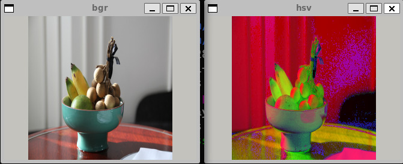
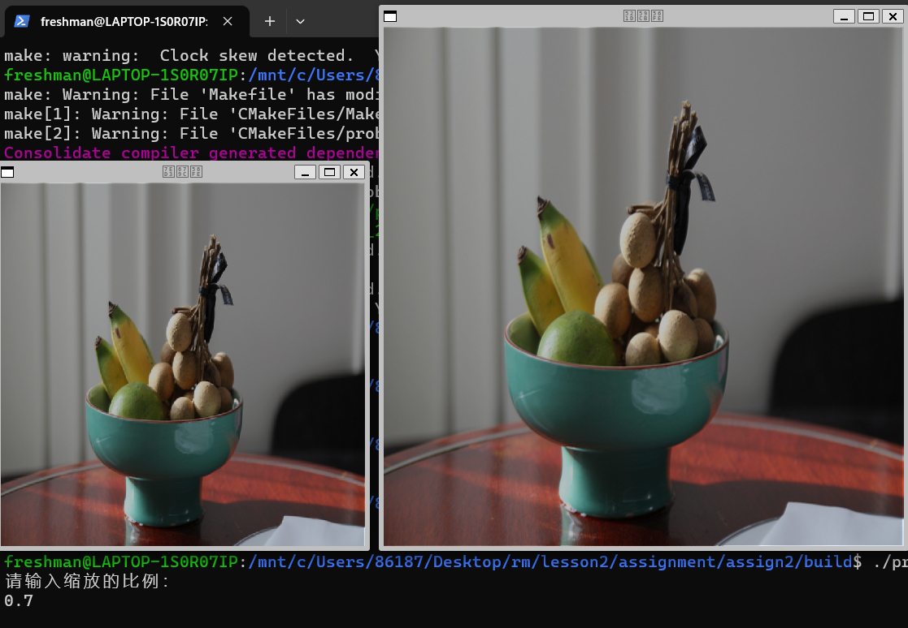
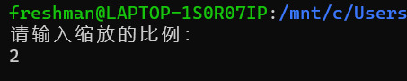
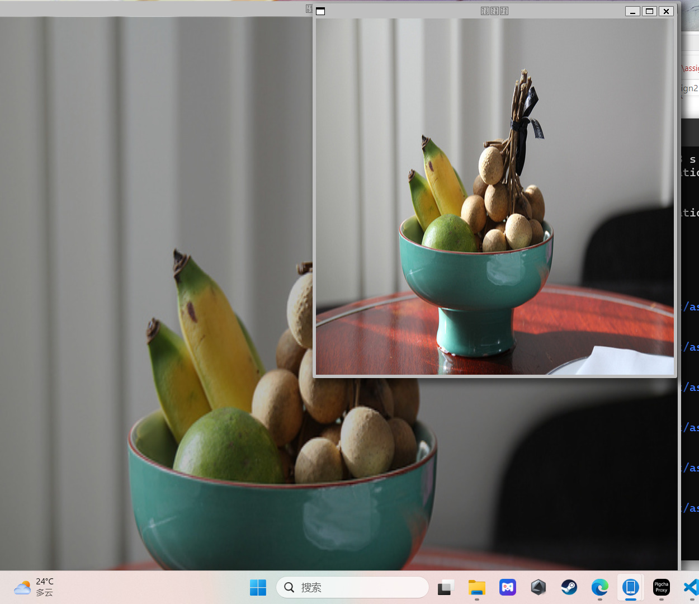
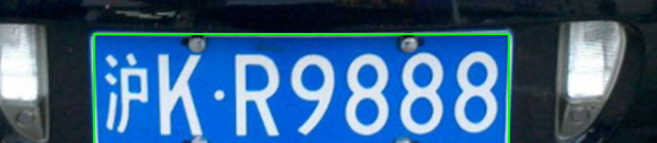
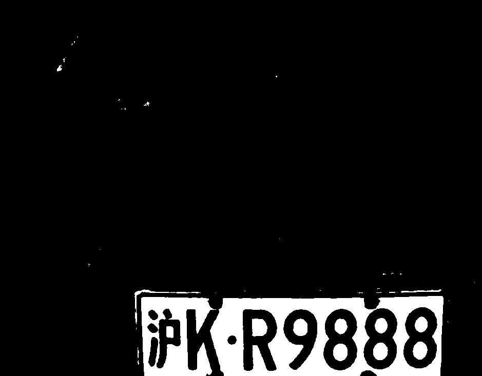
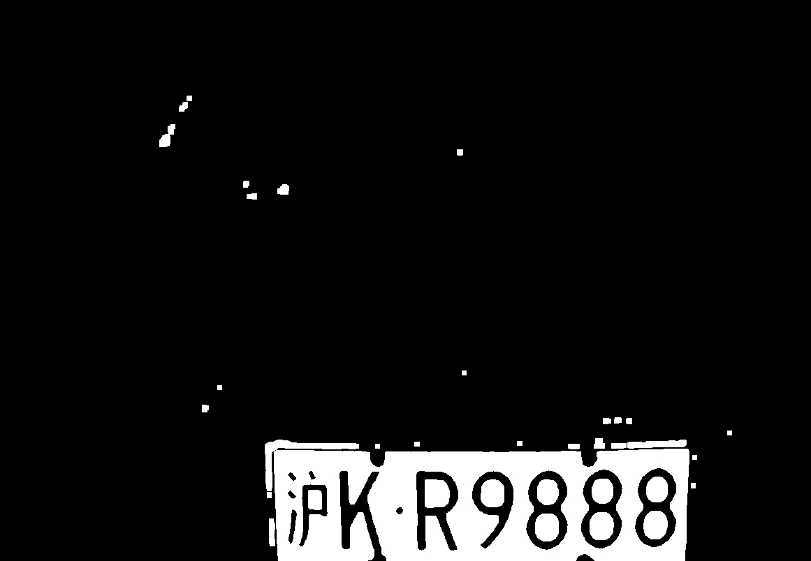
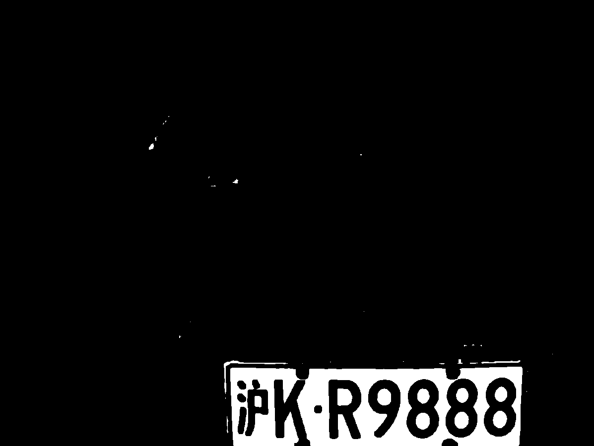

#***第二次作业***

##***task1***  
根据公式，利用b，g，r依次计算h，s，v，但是计算过程中要先将b,g,r范围转到0~1，计算完成后将h,s,v依次转换成uchar型，范围依次0~180，0~255，0~255  
代码如下
```
#include<iostream>
#include<algorithm>
#include <opencv2/opencv.hpp>
#include<opencv2/highgui/highgui.hpp>

using namespace std;
using namespace cv;

#define WINDOW_NAME_1 "bgr"
#define WINDOW_NAME_2 "hsv"

// 由b，g，r三个元素求得v
double getv(double b,double g,double r){
       double v=-1;
        v=max(b,g);
        v=max(v,r);
        return v;
}

// 由b，g，r三个元素求得s
double getss(double b,double g,double r){
       double v=getv(b,g,r);
        double s;
        if(v==0) s=0;
        else {
            double mi=255;
            mi=min(b,g);
            mi=min(mi,r);
            s=(v-mi)/v;
        }
        return s;

}

// 由b，g，r三个元素求得h
double geth(double b,double g,double r){
        double v=getv(b,g,r);
        double h;
        double mi=255;
        mi=min(b,g);
        mi=min(mi,r);
        if(v==r){
            h=60*(g-b)/(v-mi);
        }else if(v==g){
            h=120+60*(b-r)/(v-mi);
        }else if(v==b){
            h=240+60*(r-g)/(v-mi);
        }
        if(h<0) h+=360;
        return h;
}


int main (){

    //读取图像，并初始化hsv图
    Mat src,output;
    src=imread("/mnt/c/Users/86187/Desktop/rm/lesson2/assignment/assign1/test.png",1);
    //src=imread("/mnt/c/Users/86187/Desktop/rm/lesson2/assignment/assign1/车牌3.png",1);
    output=Mat(src.rows,src.cols,CV_8UC3);

    //命名窗口
    namedWindow(WINDOW_NAME_1,WINDOW_NORMAL);
    namedWindow(WINDOW_NAME_2,WINDOW_NORMAL);
    imshow(WINDOW_NAME_1,src);
    cout << src.rows << ' ' << src.cols << endl;
    
    //转化过程
    for(int i=0;i<src.rows;i++){
        for(int j=0;j<src.cols;j++){
            double b=src.at<Vec3b>(i,j)[0]/255.0;
            double g=src.at<Vec3b>(i,j)[1]/255.0;
            double r=src.at<Vec3b>(i,j)[2]/255.0; // 注意先要进行类型转换！！
                                                    //否则先计算出取整然后转double型
            double h=geth(b,g,r);
            double s=getss(b,g,r);
            double v=getv(b,g,r);
            output.at<Vec3b>(i,j)[0]=(uchar)(h/2);
            output.at<Vec3b>(i,j)[1]=(uchar)(s*255);
            output.at<Vec3b>(i,j)[2]=(uchar)(v*255);
        }
    }
    imshow(WINDOW_NAME_2,output);
    waitKey(0);
    return 0;

}
```  

实现结果    
  


##***task2***   
利用csdn和书上中讲解的金字塔的原理，似乎将图像只能缩放4的整数倍，但是可以直接按比例将原图中的像素存到要输出的图中，而非机械地删除偶数行。根据原理，再乘以高斯核实现缩放。但是自己在高斯核代码实现中存在不足，没有调用相关库生成高斯核，而是写了个数组，比较简陋。  
```
#include<iostream>
#include<algorithm>
#include <opencv2/opencv.hpp>
//#include<opencv2/highgui/highgui.hpp>

using namespace std;
using namespace cv;

#define WINDOW_NAME_1 "初始图"
#define WINDOW_NAME_2 "结果图"


//手动的高斯核(doge)
double guss3[4][4]={
    0.05,0.1,0.05,
    0.1,0.4,0.1,
    0.05,0.1,0.05

};
double guss5[6][6]={
    1.0/56,1.0/56,2.0/56,1.0/56,1.0/56,
     1.0/56,3.0/56,4.0/56,3.0/56,1.0/56,
      2.0/56,4.0/56,8.0/56,4.0/56,2.0/56,
       1.0/56,3.0/56,4.0/56,3.0/56,1.0/56,
        1.0/56,1.0/56,2.0/56,1.0/56,1.0/56,
};


//初始化输入输出图
Mat src,output;

int main (){
    double scale;
    
    //读入缩放比例和原图像
    src=imread("/mnt/c/Users/86187/Desktop/rm/lesson2/assignment/assign2/test.png",1);
    printf("请输入缩放的比例：\n");
    scanf("%lf",&scale);

    //初始化输出图
    output=Mat(src.rows*scale,src.cols*scale,CV_8UC3);
    
    //转化过程

    //缩小图像，先模糊处理
    if(scale<1)
    for(int i=1;i<src.rows-1;i++){
            for(int j=1;j<src.cols-1;j++){
                double midb;
                midb=guss3[0][0]*src.at<Vec3b>(i-1,j-1)[0]+guss3[0][1]*src.at<Vec3b>(i-1,j)[0]+guss3[0][2]*src.at<Vec3b>(i-1,j+1)[0]
                +guss3[1][0]*src.at<Vec3b>(i,j-1)[0]+guss3[1][1]*src.at<Vec3b>(i,j)[0]+guss3[1][2]*src.at<Vec3b>(i,j+1)[0]
                +guss3[2][0]*src.at<Vec3b>(i,j-1)[0]+guss3[2][1]*src.at<Vec3b>(i,j)[0]+guss3[2][2]*src.at<Vec3b>(i,j+1)[0];
                double midg;
                midg=guss3[0][0]*src.at<Vec3b>(i-1,j-1)[1]+guss3[0][1]*src.at<Vec3b>(i-1,j)[1]+guss3[0][2]*src.at<Vec3b>(i-1,j+1)[1]
                +guss3[1][0]*src.at<Vec3b>(i,j-1)[1]+guss3[1][1]*src.at<Vec3b>(i,j)[1]+guss3[1][2]*src.at<Vec3b>(i,j+1)[1]
                +guss3[2][0]*src.at<Vec3b>(i,j-1)[1]+guss3[2][1]*src.at<Vec3b>(i,j)[1]+guss3[2][2]*src.at<Vec3b>(i,j+1)[1];
                double midr;
                midr=guss3[0][0]*src.at<Vec3b>(i-1,j-1)[2]+guss3[0][1]*src.at<Vec3b>(i-1,j)[2]+guss3[0][2]*src.at<Vec3b>(i-1,j+1)[2]
                +guss3[1][0]*src.at<Vec3b>(i,j-1)[2]+guss3[1][1]*src.at<Vec3b>(i,j)[2]+guss3[1][2]*src.at<Vec3b>(i,j+1)[2]
                +guss3[2][0]*src.at<Vec3b>(i,j-1)[2]+guss3[2][1]*src.at<Vec3b>(i,j)[2]+guss3[2][2]*src.at<Vec3b>(i,j+1)[2];
                src.at<Vec3b>(i,j-1)[0]=(uchar)midb;
                src.at<Vec3b>(i,j-1)[1]=(uchar)midg;
                src.at<Vec3b>(i,j-1)[2]=(uchar)midr;
            }
    }

    //根据缩放比例构造要输出的图
    for(int i=0;i<output.rows;i++){
            for(int j=0;j<output.cols;j++){
                int x=i/scale;
                int y=j/scale;
                output.at<Vec3b>(i,j)[0]=src.at<Vec3b>(x,y)[0];
                output.at<Vec3b>(i,j)[1]=src.at<Vec3b>(x,y)[1];
                output.at<Vec3b>(i,j)[2]=src.at<Vec3b>(x,y)[2];
            }
    }

    //放大图像 ，后模糊处理
    if(scale>1)
    for(int i=1;i<output.rows-1;i++){
            for(int j=1;j<output.cols-1;j++){
                double midb;
                midb=guss3[0][0]*output.at<Vec3b>(i-1,j-1)[0]+guss3[0][1]*output.at<Vec3b>(i-1,j)[0]+guss3[0][2]*output.at<Vec3b>(i-1,j+1)[0]
                +guss3[1][0]*output.at<Vec3b>(i,j-1)[0]+guss3[1][1]*output.at<Vec3b>(i,j)[0]+guss3[1][2]*output.at<Vec3b>(i,j+1)[0]
                +guss3[2][0]*output.at<Vec3b>(i,j-1)[0]+guss3[2][1]*output.at<Vec3b>(i,j)[0]+guss3[2][2]*output.at<Vec3b>(i,j+1)[0];
                double midg;
                midg=guss3[0][0]*output.at<Vec3b>(i-1,j-1)[1]+guss3[0][1]*output.at<Vec3b>(i-1,j)[1]+guss3[0][2]*output.at<Vec3b>(i-1,j+1)[1]
                +guss3[1][0]*output.at<Vec3b>(i,j-1)[1]+guss3[1][1]*output.at<Vec3b>(i,j)[1]+guss3[1][2]*output.at<Vec3b>(i,j+1)[1]
                +guss3[2][0]*output.at<Vec3b>(i,j-1)[1]+guss3[2][1]*output.at<Vec3b>(i,j)[1]+guss3[2][2]*output.at<Vec3b>(i,j+1)[1];
                double midr;
                midr=guss3[0][0]*output.at<Vec3b>(i-1,j-1)[2]+guss3[0][1]*output.at<Vec3b>(i-1,j)[2]+guss3[0][2]*output.at<Vec3b>(i-1,j+1)[2]
                +guss3[1][0]*output.at<Vec3b>(i,j-1)[2]+guss3[1][1]*output.at<Vec3b>(i,j)[2]+guss3[1][2]*output.at<Vec3b>(i,j+1)[2]
                +guss3[2][0]*output.at<Vec3b>(i,j-1)[2]+guss3[2][1]*output.at<Vec3b>(i,j)[2]+guss3[2][2]*output.at<Vec3b>(i,j+1)[2];
                output.at<Vec3b>(i,j-1)[0]=(uchar)midb;
                output.at<Vec3b>(i,j-1)[1]=(uchar)midg;
                output.at<Vec3b>(i,j-1)[2]=(uchar)midr;
            }
    }
    imshow(WINDOW_NAME_1,src);
    imshow(WINDOW_NAME_2,output);
    waitKey(0);
    return 0;

}
```
实现结果    





##***task3***  
主要是利用车牌是蓝色，将bgr图转化为hsv图，然后根据inrange函数只保留蓝色部分，而inrange函数参数的选取对最后结果很重要。之后再进行腐蚀，膨胀等操作，然后做出图中轮廓，再找到车牌对应轮廓在原图中标出其最小外接矩形。
代码如下  
```
#include <opencv2/opencv.hpp>
#include<opencv2/highgui/highgui.hpp>
#include<opencv2/imgproc/imgproc.hpp>
#include<iostream>

using namespace std;
using namespace cv;

#define widname_1 "src"
#define widname_2 "out"
#define widname_3 "out1"
#define widname_4 "out2"
#define widname_5 "out3"

int main() {
    // 图像加载
    Mat image = imread("/mnt/c/Users/86187/Desktop/rm/lesson2/assignment/assign3/车牌3.png");

    if (image.empty()) {
        std::cerr << "Could not open or find the image." << std::endl;
        return -1;
    }

    // 图像预处理，转成hsv图像
    Mat hsvImage,erodeimage,dilateimage;
    Mat element=getStructuringElement(MORPH_RECT,Size(7,7),Point(3,3));
    vector<Vec4i> g_vHierarchy;
    cvtColor(image, hsvImage, COLOR_BGR2HSV);
    imshow(widname_1, image);

    //二值化，只保留蓝色部分 
    inRange(hsvImage, Scalar(100, 223, 40), Scalar(130, 255, 255), hsvImage);
    imshow(widname_2, hsvImage);

    //膨胀
    dilate(hsvImage,dilateimage,element);    
    imshow(widname_3, dilateimage);

    //腐蚀
    erode(dilateimage,erodeimage,element);
    imshow(widname_4, erodeimage);
    GaussianBlur(erodeimage, erodeimage, Size(5, 5), 0);
    
    //寻找轮廓
    vector<vector<Point>> contours;
    findContours(erodeimage, contours, g_vHierarchy, RETR_TREE, CHAIN_APPROX_SIMPLE, Point(0, 0));
    
    //寻找图中轮廓面积最大值，即车牌的轮廓
    double maxarea=-1;
    int aim=0;
    for(int i=0;i<contours.size();i++){
        double area = contourArea(contours[i]);
        if(area>maxarea){
            aim=i;
            maxarea=area;
        }
    }

    //求该轮廓的最小外接矩形并输出在原图
    Rect rect = boundingRect(contours[aim]);
     rectangle(image, rect, Scalar(0, 255, 0), 2);
     imshow(widname_5, image);
    waitKey(0);
    return 0;
}
```   

实现结果      



